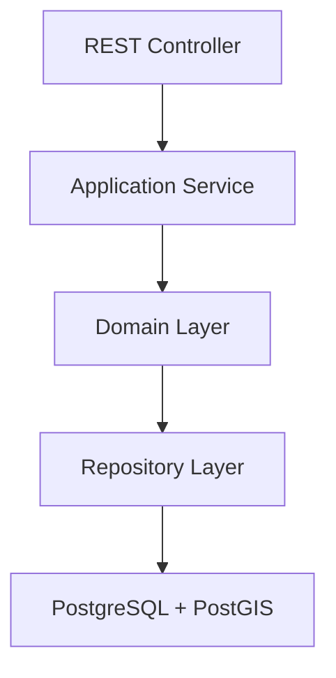
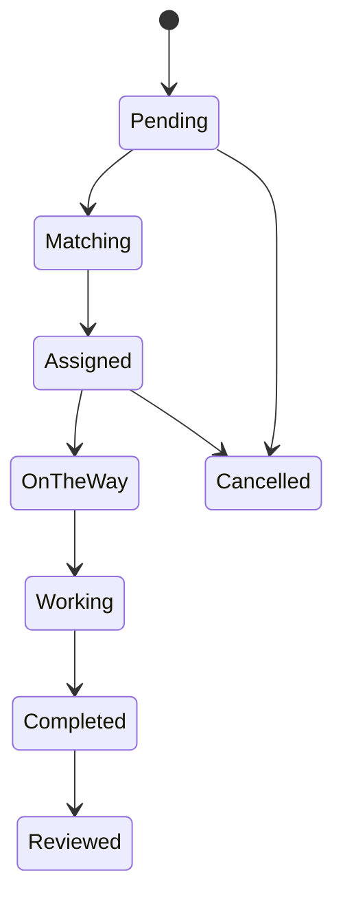
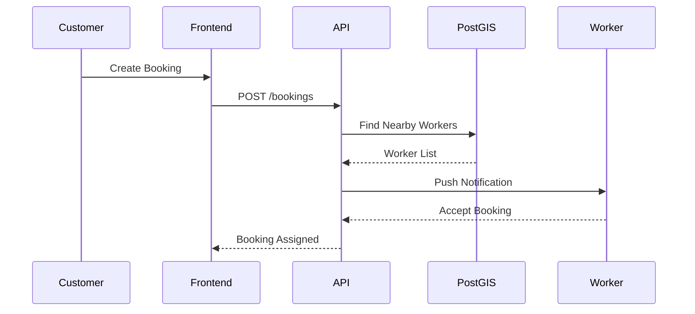
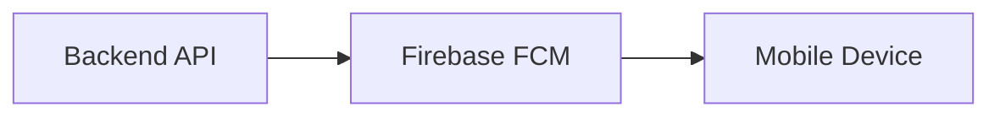
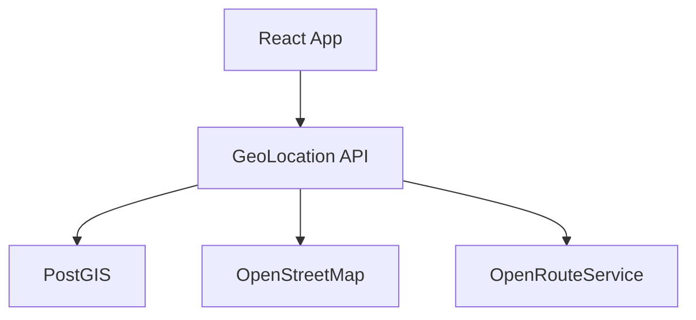
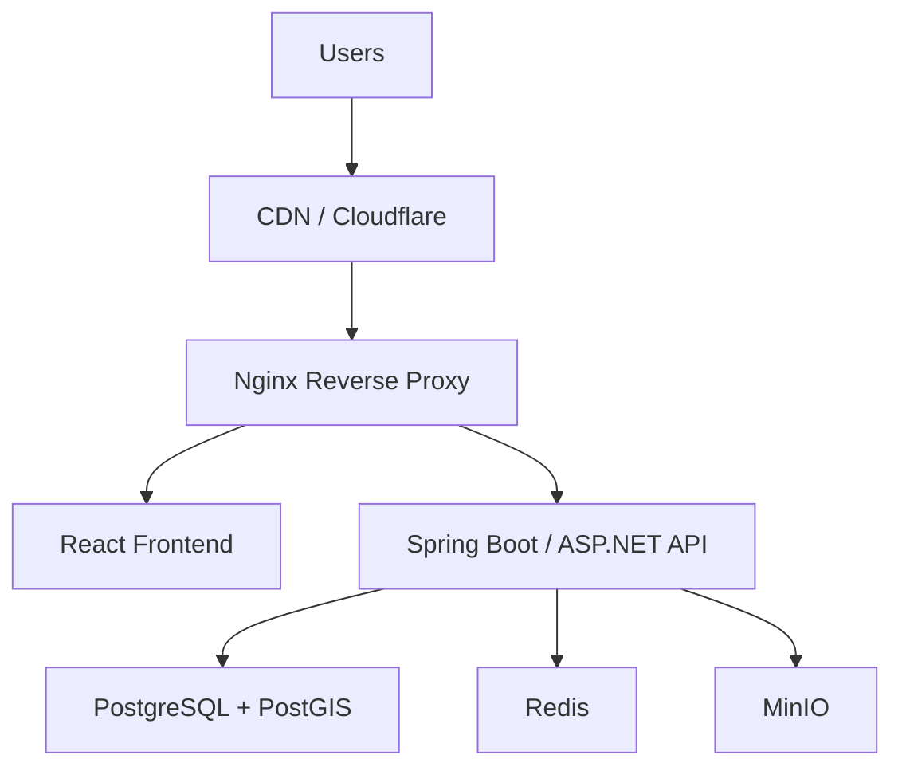

# FixNow - System Architecture (MVP)

```mermaid
flowchart TB

    %% =========================
    %% CLIENT LAYER
    %% =========================
    subgraph CLIENTS["Client Applications"]

        CUSTOMER["Customer App
        React / React Native"]

        WORKER["Worker App
        React / React Native"]

        ADMIN["Admin Dashboard
        React"]

    end

    %% =========================
    %% API GATEWAY
    %% =========================
    GATEWAY["API Gateway / Nginx"]

    CUSTOMER --> GATEWAY
    WORKER --> GATEWAY
    ADMIN --> GATEWAY

    %% =========================
    %% BACKEND
    %% =========================
    subgraph BACKEND["Backend API Layer"]

        AUTH["Auth Module"]
        BOOKING["Booking Module"]
        MATCHING["Worker Matching Module"]
        JOB["Job Marketplace Module"]
        QUOTATION["Quotation Module"]
        REVIEW["Review Module"]
        GEO["GeoLocation Module"]
        NOTIFICATION["Notification Module"]
        ADMINMODULE["Admin Module"]

    end

    GATEWAY --> AUTH
    GATEWAY --> BOOKING
    GATEWAY --> MATCHING
    GATEWAY --> JOB
    GATEWAY --> QUOTATION
    GATEWAY --> REVIEW
    GATEWAY --> GEO
    GATEWAY --> NOTIFICATION
    GATEWAY --> ADMINMODULE

    %% =========================
    %% DATABASE
    %% =========================
    subgraph DATABASE["Database Layer"]

        POSTGRES["PostgreSQL"]
        POSTGIS["PostGIS Extension"]
        REDIS["Redis Cache"]

    end

    AUTH --> POSTGRES
    BOOKING --> POSTGRES
    JOB --> POSTGRES
    QUOTATION --> POSTGRES
    REVIEW --> POSTGRES
    ADMINMODULE --> POSTGRES

    MATCHING --> POSTGIS
    GEO --> POSTGIS

    AUTH --> REDIS
    BOOKING --> REDIS
    MATCHING --> REDIS

    %% =========================
    %% STORAGE
    %% =========================
    subgraph STORAGE["Storage Layer"]

        MINIO["MinIO Object Storage"]

    end

    AUTH --> MINIO
    JOB --> MINIO
    REVIEW --> MINIO

    %% =========================
    %% EXTERNAL SERVICES
    %% =========================
    subgraph EXTERNAL["External Services"]

        OSM["OpenStreetMap"]
        ORS["OpenRouteService"]
        NOMINATIM["Nominatim Geocoding"]
        FCM["Firebase Cloud Messaging"]

    end

    GEO --> OSM
    GEO --> ORS
    GEO --> NOMINATIM

    NOTIFICATION --> FCM
```

```mermaid
flowchart TB

    CONTROLLER["REST Controller"]
    APP["Application Service"]
    DOMAIN["Domain Layer"]
    REPOSITORY["Repository Layer"]
    DB["PostgreSQL + PostGIS"]

    CONTROLLER --> APP
    APP --> DOMAIN
    DOMAIN --> REPOSITORY
    REPOSITORY --> DB
```

Booking Workflow Architecture

```mermaid
stateDiagram-v2

    [*] --> Pending

    Pending --> Matching
    Matching --> Assigned
    Assigned --> OnTheWay
    OnTheWay --> Working
    Working --> Completed
    Completed --> Reviewed

    Pending --> Cancelled
    Assigned --> Cancelled
```

Worker Matching Flow

```mermaid
sequenceDiagram

    participant Customer
    participant Frontend
    participant API
    participant PostGIS
    participant Worker

    Customer->>Frontend: Create Booking
    Frontend->>API: POST /bookings
    API->>PostGIS: Find Nearby Workers
    PostGIS-->>API: Worker List
    API->>Worker: Push Notification
    Worker-->>API: Accept Booking
    API-->>Frontend: Booking Assigned
```

Notification Flow

```mermaid
flowchart LR

    API["Backend API"]
    FCM["Firebase FCM"]
    DEVICE["Mobile Device"]

    API --> FCM
    FCM --> DEVICE
```

GeoLocation Architecture

```mermaid
flowchart TB

    APP["React App"]

    GEOAPI["GeoLocation API"]

    POSTGIS["PostGIS"]

    OSM["OpenStreetMap"]
    ORS["OpenRouteService"]

    APP --> GEOAPI

    GEOAPI --> POSTGIS
    GEOAPI --> OSM
    GEOAPI --> ORS
```

Deployment Architecture

```mermaid
flowchart TB

    USER["Users"]

    CDN["CDN / Cloudflare"]

    NGINX["Nginx Reverse Proxy"]

    FRONTEND["React Frontend"]

    BACKEND["Spring Boot / ASP.NET API"]

    DB["PostgreSQL + PostGIS"]

    REDIS["Redis"]

    STORAGE["MinIO"]

    USER --> CDN
    CDN --> NGINX

    NGINX --> FRONTEND
    NGINX --> BACKEND

    BACKEND --> DB
    BACKEND --> REDIS
    BACKEND --> STORAGE
```