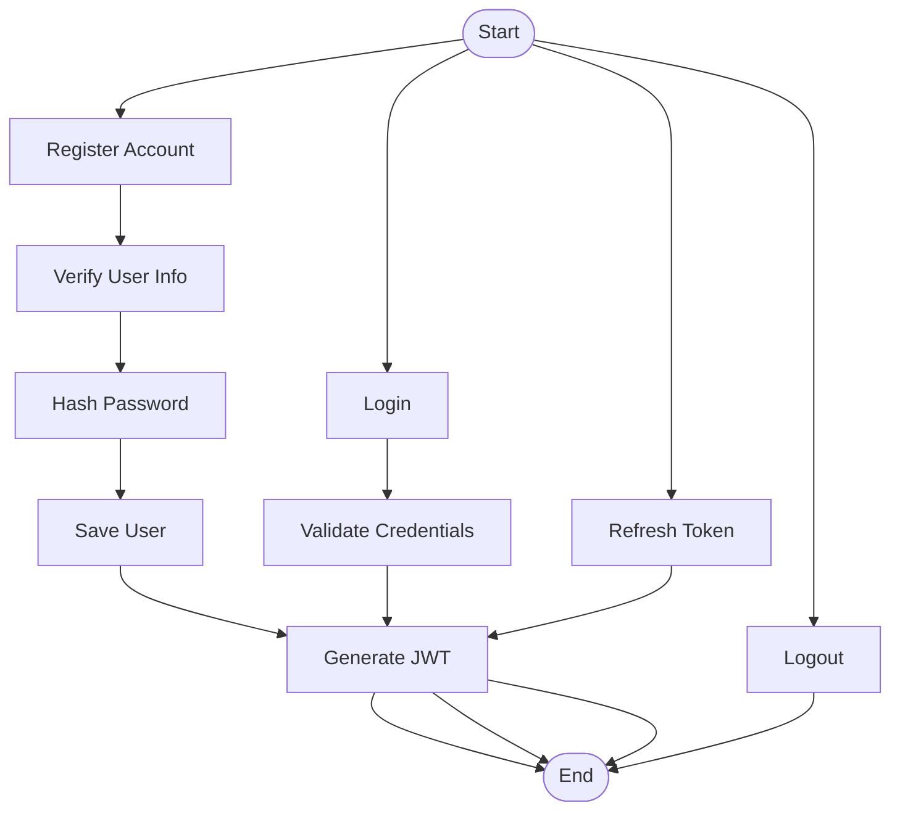
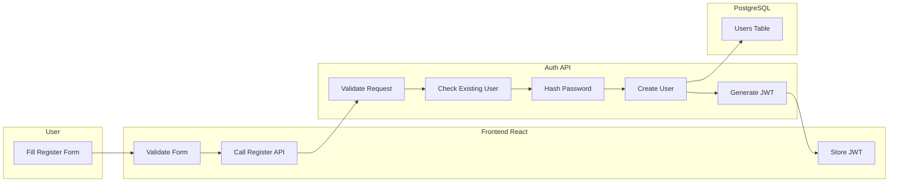
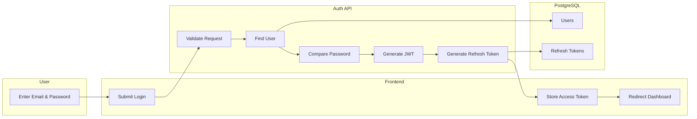
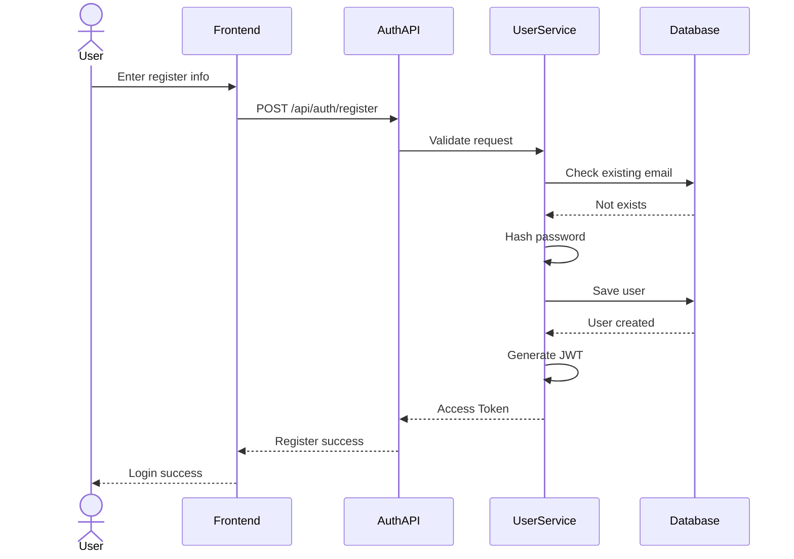
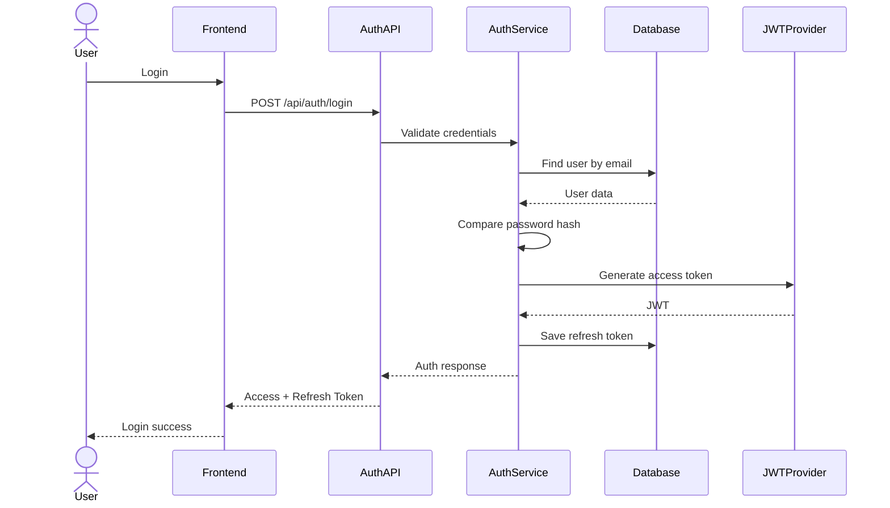
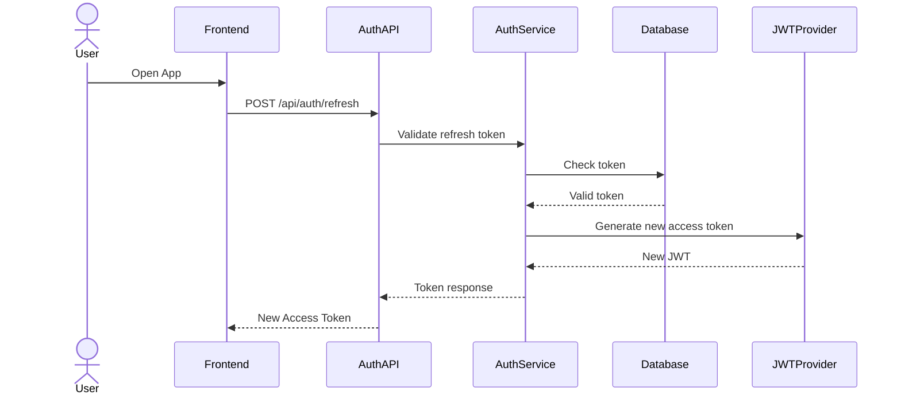
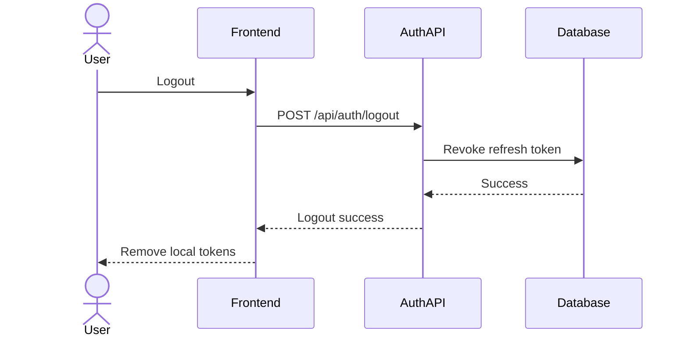
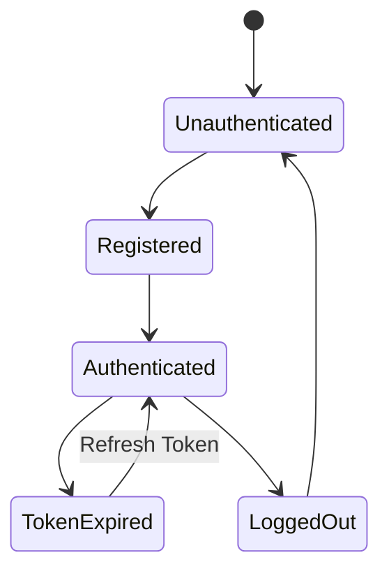
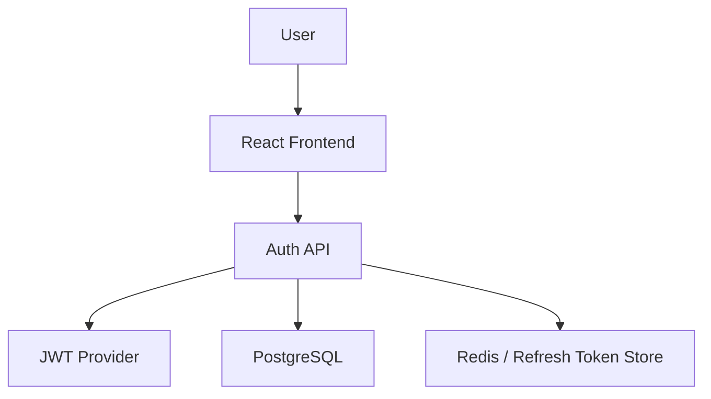

P0 – Authentication Module Design (FixNow)
1. Authentication Scope (MVP)
Chức năng thuộc P0
Feature	Description
Register	Đăng ký
Login	Đăng nhập
JWT Authentication	Access Token
Refresh Token	Gia hạn phiên
Logout	Đăng xuất
Role-based Access	Customer / Worker / Admin
Password Hashing	BCrypt
Email/Phone Verification	Optional MVP
Worker KYC Submit	MVP worker onboarding
2. Authentication Workflow

3. Swimlane – User Registration

4. Swimlane – Login Flow

5. Sequence Diagram – Register

6. Sequence Diagram – Login

7. Sequence Diagram – Refresh Token

8. Sequence Diagram – Logout

9. Authentication State Diagram

10. JWT Authentication Architecture

11. Authentication API Contract
Register
POST /api/v1/auth/register

Request:

{
  "email": "user@gmail.com",
  "password": "123456",
  "fullName": "John Doe",
  "role": "CUSTOMER"
}
Login
POST /api/v1/auth/login

Request:

{
  "email": "user@gmail.com",
  "password": "123456"
}

Response:

{
  "accessToken": "...",
  "refreshToken": "...",
  "expiresIn": 3600
}
12. Database Design
users
Column	Type
id	UUID
email	varchar
password_hash	varchar
role	varchar
status	varchar
created_at	timestamp
refresh_tokens
Column	Type
id	UUID
user_id	UUID
token	text
expires_at	timestamp
revoked	boolean
13. Security Design
Security	Solution
Password hashing	BCrypt
Auth	JWT
Refresh token	DB/Redis
API security	HTTPS
Rate limiting	Redis
CORS	Allowed origins
XSS	HttpOnly Cookie
CSRF	SameSite Cookie
14. Recommended Tech Stack
Frontend
Feature	Tech
Auth State	Zustand
HTTP	Axios
Route Guard	React Router
Token Refresh	Axios Interceptor
Backend
Spring Boot
Spring Security
JWT
BCrypt

OR

ASP.NET Core
JWT Bearer
Identity
BCrypt/PasswordHasher
15. MVP Authentication Priorities
Priority	Feature
P0	Register
P0	Login
P0	JWT
P0	Refresh Token
P0	Logout
P1	OTP
P1	Social Login
P2	MFA