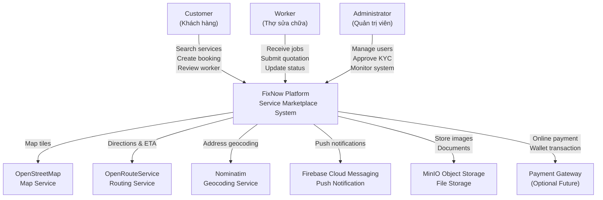
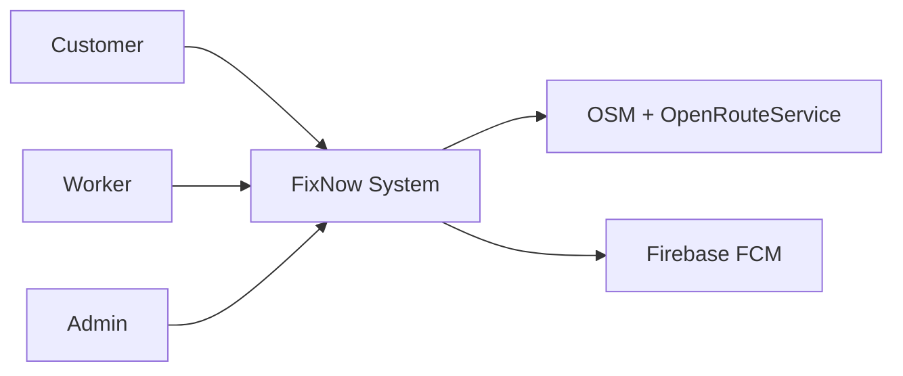
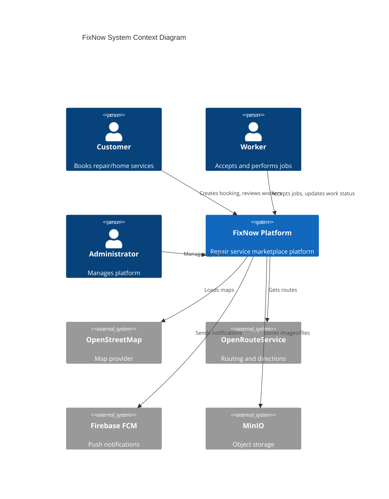

| Priority | Module          |
| -------- | --------------- |
| P0       | Authentication  |
| P0       | Worker Matching |
| P0       | Booking         |
| P0       | Nearby Search   |
| P0       | Notification    |
| P1       | Route Direction |
| P1       | Admin           |
| P2       | Wallet          |
| P2       | AI Assistant    |

# FixNow - System Context Diagram

Context Diagram – MVP Version

C4 Model – Level 1 Context Diagram
